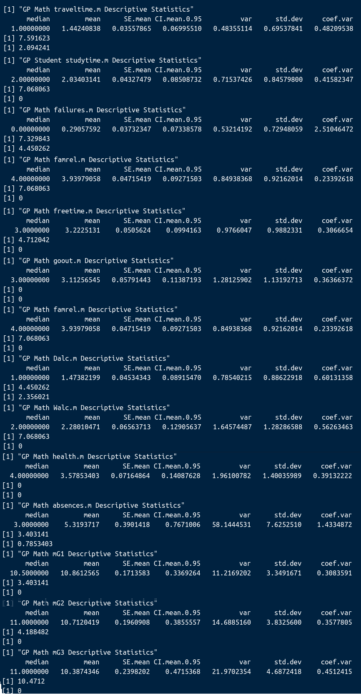
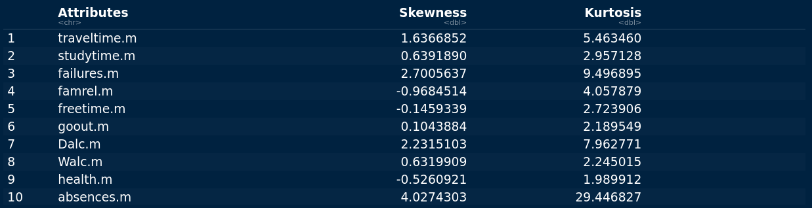

We installed, where applicable, then import our R libraries. We then imported our csv file dataset as a dataframe called grades
```{r, echo=FALSE, results = FALSE, message=FALSE}
# Import libraries
#install then import our libraries
#install.packages('tidyverse') # we use this to do things like graphing
#install.packages("moments") 
library(tidyverse, warn.conflict=F)
library(pastecs) #descriptive statistic library
#library(reshape) #for boxplot preparation
library(moments) #for skew and kurtosis
library(reshape2)#for boxplot preparation
library(knitr) #for html document setup
library(caTools) # used for linear regression modelling
library(ElemStatLearn) # used for logistic regression modelling

# Import Dataset
grades <- read.csv(file = 'dataset.csv')
```

## Data Cleaning: Fixing Data Types
Below we see that our data consists of 23 characters and 28 integers, we will convert the characters to factors. For integers we will leave them the way they are. R uses the numeric data type as a default, this means a variable could contain a 1 or a 1.0 decimal place. By specifying that the variables are integers R is saying it will treat them as whole numbers. The reason we are doing all this is to avail of R's functionality for manipulating variables. Factors have more categorical options and features than characters, which are, to R just strings of text.
```{r, echo=FALSE}
sapply(grades, class)
```
We will loop through our columns and convert character columns into factors. When we are finished we will check our result to ensure it worked.
```{r, echo=FALSE}
#this loop says for each column in our dataset grades, if the column is of character type then convert it to a factor.
for (i in colnames(grades)){
  if(class(grades[[i]])=="character"){
    grades[[i]] <- as.factor(grades[[i]])
  }
}
sapply(grades, class) # We see below that it has worked.
```

## Data Cleaning: Data Subsetting
We want to create a summary table to examine our data but we have too many attributes so we will split our dataset up and examine the groups. The idea here is that we will test each group of variables against our grades to see which ones we will keep for our predictive model.
```{r, echo=FALSE}
#we first split the dataset into two sub groups for each school.
gp_school <- grades[which(grades$school=='GP'),]
ms_school <- grades[which(grades$school=='MS'),]

# now we split into 3 sub groups for student, maths and language
#Student: eg. sex, age, address, famsize, Pstatus, Medu, Fedu, Mjob, Fjob, reason, nursery internet

# Maths .m, mG 
maths_tag1 <- ".m"
maths_tag2 <- "mG"

# Portuguese .p, pG
lang_tag1 <- ".p"
lang_tag2 <- "pG"


#first school
school1_names = names(gp_school)
school1_student_names <- vector()
school1_maths_names <-vector()
school1_langs_names <-vector()

for (i in school1_names){
  #print(i)
  if(!(i=="school"))
    {
    math1 <- grepl(maths_tag1, i, fixed=TRUE)
    lang1 <- grepl(lang_tag1, i, fixed=TRUE)
    
    math2 <- grepl(maths_tag2, i, fixed=TRUE)
    lang2 <- grepl(lang_tag2, i, fixed=TRUE)
    
    #we could improve the below statements with an OR condition
    if(math1){
      school1_maths_names <- append(school1_maths_names, i)
    }
    else if(math2){
      school1_maths_names <- append(school1_maths_names, i)
    }
    else if(lang1){
      school1_langs_names <- append(school1_langs_names, i)
    }
    else if(lang2){
      school1_langs_names <- append(school1_langs_names, i)
    }
    else{
        school1_student_names <- append(school1_student_names, i)
    }
  }
}

#second school
school2_names = names(ms_school)
school2_student_names <- vector()
school2_maths_names <-vector()
school2_langs_names <-vector()

for (i in school2_names){
  #print(i)
  if(!(i=="school"))
    {
    math1 <- grepl(maths_tag1, i, fixed=TRUE)
    lang1 <- grepl(lang_tag1, i, fixed=TRUE)
    
    math2 <- grepl(maths_tag2, i, fixed=TRUE)
    lang2 <- grepl(lang_tag2, i, fixed=TRUE)
    
    #we could improve the below statements with an OR condition
    if(math1){
      school2_maths_names <- append(school2_maths_names, i)
    }
    else if(math2){
      school2_maths_names <- append(school2_maths_names, i)
    }
    else if(lang1){
      school2_langs_names <- append(school2_langs_names, i)
    }
    else if(lang2){
      school2_langs_names <- append(school2_langs_names, i)
    }
    else{
        school2_student_names <- append(school2_student_names, i)
    }
  }
}
```

## Gabriel Pereira (GP) & Mousinho da Silveira (MS)
Our dataset relates to a survey carried out in two different schools. There is 88% less observations in Mousinho da Silveira (MS) school (40 observations) vs Gabriel Pereira (GP) school (342).

```{r, echo=FALSE}
dim(grades)
```

```{r, echo=FALSE}
summary(grades$school)
```

```{r, echo=FALSE}
head(grades)
```

```{r, echo=FALSE}
tail(grades)
```

As mentioned previously in Part 2 [Data Collection & Preparation](2_dcprep.html), we wanted a summary table to examine our data but we had too many attributes so we split our dataset up into groups for examination. 
These groups again were:

1. General Student Information, 
2. Maths Student Information,
3. Portuguese Language Student Information,

Using the Summary function in R we examine students of Gabriel Pereira (GP) school and Mousinho da Silveira (MS) school. To understand outliers with our data we calculated the skew and kurtosis. Finally to visualise these two tables we create a bar plot of all our categorical variables then histograms, QQ plots and grouped boxplot of our numeric variables.


## Gabriel Pereira (GP): All Students

Now we examine our students from GP school
```{r, echo=FALSE}
students = gp_school[school1_student_names]
summary(students)
```

```{=html}
<figure style="text-align: center;">
  <figcaption>Fig.1 - Statistical summary table of Students of Gabriel Pereira (GP) school</figcaption>
</figure> <br />
```

We generate GP Student Descriptive Statistics such as mean, variance and standard deviation. We also see what percentage are greater than a standard deviation of 1.96 and 3.29.
```{r, echo=FALSE}
print("GP Student Age Descriptive Statistics")
pastecs::stat.desc(students$age, basic=F)
zage<- abs(scale(students$age))

print("% values with z-score > 1.96")
FSA::perc(as.numeric(zage), 1.96, "gt")
print("% values with z-score > 3.29")
FSA::perc(as.numeric(zage), 3.29, "gt")

print("GP Student Mother's Education Descriptive Statistics")
pastecs::stat.desc(students$Medu, basic=F)
zMedu<- abs(scale(students$Medu))

print("% values with z-score > 1.96")
FSA::perc(as.numeric(zMedu), 1.96, "gt")
print("% values with z-score > 3.29")
FSA::perc(as.numeric(zMedu), 3.29, "gt")

print("GP Student Father's Education Descriptive Statistics")
pastecs::stat.desc(students$Fedu, basic=F)
zFedu<- abs(scale(students$Fedu))

print("% values with z-score > 1.96")
FSA::perc(as.numeric(zFedu), 1.96, "gt")
print("% values with z-score > 3.29")
FSA::perc(as.numeric(zFedu), 3.29, "gt")
```

```{=html}
<figure style="text-align: center;">
  <figcaption>Fig.1a - Descriptive Statistics table of Students of Gabriel Pereira (GP) school</figcaption>
</figure> <br />
```

To understand outliers with our student data we calculate the skew and kurtosis
```{r, echo=FALSE}
student_title <- c('age', 'Medu', 'Fedu')
student_skew <- c(skewness(students$age), skewness(students$Medu), skewness(students$Fedu))
student_kurtosis <- c(kurtosis(students$age), kurtosis(students$Medu), kurtosis(students$Fedu))


data <- data.frame(student_title, student_skew, student_kurtosis)
colnames(data)[1] <- "Attributes"
colnames(data)[2] <- "Skewness"
colnames(data)[3] <- "Kurtosis"
head(data)
```

```{=html}
<figure style="text-align: center;">
  <figcaption>Fig.2 - Skew & Kurtosis table of Students of Gabriel Pereira (GP) school</figcaption>
</figure> <br />
```

To visualise these two tables we create a bar plot of all our categorical variables then histograms, QQ plots and grouped boxplot of our numeric variables.
```{r, echo=FALSE}
# we create our barchart dataset
student_attributes = c(rep("sex", 2), 
           rep("address",2), 
           rep("famsize",2), 
           rep("Pstatus",2), 
           rep("Mjob", 5), 
           rep("Fjob",5),
           rep("reason",4),
           rep("nursery",2), 
           rep('internet',2)
           )
labels1 = c('F','M', 
           'R','U', 
           'GT3', 'LE3', 
           'A','T',
           'at_home','health','other','services','teacher',
           'at_home','health','other','services','teacher',
           'course','home','other','reputation',
           'no', 'yes',
           'no','yes'
           )
number_of = c(sum(students$sex == 'F'),
              sum(students$sex == 'M'),
              sum(students$address == 'R'),
              sum(students$address == 'U'),
              sum(students$famsize == 'GT3'),
              sum(students$famsize == 'LE3'),
              sum(students$Pstatus == 'A'),
              sum(students$Pstatus == 'T'),
              sum(students$Mjob == 'at_home'),
              sum(students$Mjob == 'health'), 
              sum(students$Mjob == 'other'),
              sum(students$Mjob == 'services'),
              sum(students$Fjob == 'teacher'),
              sum(students$Fjob == 'at_home'),
              sum(students$Fjob == 'health'), 
              sum(students$Fjob == 'other'),
              sum(students$Fjob == 'services'),
              sum(students$Fjob == 'teacher'),
              sum(students$reason == 'course'), 
              sum(students$reason == 'home'),
              sum(students$reason == 'other'),
              sum(students$reason == 'reputation'),
              sum(students$nursery == 'no'),
              sum(students$nursery == 'yes'),
              sum(students$internet == 'no'),
              sum(students$internet == 'yes'))

data <- data.frame(student_attributes,labels1,number_of)
# Now we generate our stacked barchart
ggplot(data,
       alpha=factor(number_of),
       aes(fill=labels1, y=number_of, x=student_attributes)) + 
  geom_bar(position="stack", stat="identity") + 
  xlab("Student Categorical Attributes") + ylab("Frequency") +
  labs(title="GP: Overview of Student Categorical Attributes") +
  theme(legend.position = "bottom") +
  scale_fill_discrete(breaks=labels1)
```

```{=html}
<figure style="text-align: center;">
  <figcaption>Fig.3 - Stacked bar chart of Students of Gabriel Pereira (GP) school</figcaption>
</figure> <br />
```

```{r, echo=FALSE}
#ref https://www.ucd.ie/ecomodel/Resources/QQplots_WebVersion.html
par(mfrow=c(3,3))

#hist
x <- students$age
age_his<-hist(x, breaks=6, col="dodgerblue1", xlab="Students",
        main="Age")
xfit<-seq(min(x),max(x),length=20)
yfit<-dnorm(xfit,mean=mean(x),sd=sd(x))
yfit <- yfit*diff(age_his$mids[1:2])*length(x)
lines(xfit, yfit, col="red", lwd=2)

#qqplot
qqnorm(x)
qqline(x, col=2) #show a line on the plot

#boxplot
boxplot(x, horizontal=TRUE, main="age Boxplot")

#hist
x <- students$Medu
Medu_his<-hist(x, breaks=4, col="dodgerblue1", xlab="Students",
        main="Medu")
xfit<-seq(min(x),max(x),length=20)
yfit<-dnorm(xfit,mean=mean(x),sd=sd(x))
yfit <- yfit*diff(Medu_his$mids[1:2])*length(x)
lines(xfit, yfit, col="red", lwd=2)

#qqplot
qqnorm(x)
qqline(x, col=2) #show a line on theplot

#boxplot
boxplot(x, horizontal=TRUE, main="Medu Boxplot")

#hist
x <- students$Fedu
Fedu_his<-hist(x, breaks=5, col="dodgerblue1", xlab="Students",
        main="Fedu")
xfit<-seq(min(x),max(x),length=20)
yfit<-dnorm(xfit,mean=mean(x),sd=sd(x))
yfit <- yfit*diff(Medu_his$mids[1:2])*length(x)
lines(xfit, yfit, col="red", lwd=2)

#qqplot
qqnorm(x)
qqline(x, col=2) #show a line on theplot

#boxplot
boxplot(x, horizontal=TRUE, main="Fedu Boxplot")
```
```{=html}
<figure style="text-align: center;">
  <figcaption>Fig.4 - Histograms, Box plots & QQ plots of Students of Gabriel Pereira (GP) school</figcaption>
</figure> <br />
```
We repeat the same process for the rest of the school, then we do the same for MS school.

## Gabriel Pereira (GP): Maths Students
```{r, echo=FALSE}
maths = gp_school[school1_maths_names]
summary(maths)
```

```{=html}
<figure style="text-align: center;">
  <figcaption>Fig.5 - Statistical summary table of Maths at Gabriel Pereira (GP) school</figcaption>
</figure> <br />
```

```{r, echo=FALSE}
print("GP Math traveltime.m Descriptive Statistics")
pastecs::stat.desc(maths$traveltime.m, basic=F)
ztraveltime<- abs(scale(maths$traveltime.m))
FSA::perc(as.numeric(ztraveltime), 1.96, "gt")
FSA::perc(as.numeric(ztraveltime), 3.29, "gt")

print("GP Student studytime.m Descriptive Statistics")
pastecs::stat.desc(maths$studytime.m, basic=F)
zstudytimem<- abs(scale(maths$studytime.m))
FSA::perc(as.numeric(zstudytimem), 1.96, "gt")
FSA::perc(as.numeric(zstudytimem), 3.29, "gt")

print("GP Math failures.m Descriptive Statistics")
pastecs::stat.desc(maths$failures.m, basic=F)
zfailuresm<- abs(scale(maths$failures.m))
FSA::perc(as.numeric(zfailuresm), 1.96, "gt")
FSA::perc(as.numeric(zfailuresm), 3.29, "gt")

print("GP Math famrel.m Descriptive Statistics")
pastecs::stat.desc(maths$famrel.m, basic=F)
zfamrelm<- abs(scale(maths$famrel.m))
FSA::perc(as.numeric(zfamrelm), 1.96, "gt")
FSA::perc(as.numeric(zfamrelm), 3.29, "gt")

print("GP Math freetime.m Descriptive Statistics")
pastecs::stat.desc(maths$freetime.m, basic=F)
zfreetimem<- abs(scale(maths$freetime.m))
FSA::perc(as.numeric(zfreetimem), 1.96, "gt")
FSA::perc(as.numeric(zfreetimem), 3.29, "gt")

print("GP Math goout.m Descriptive Statistics")
pastecs::stat.desc(maths$goout.m, basic=F)
zgooutm<- abs(scale(maths$goout.m))
FSA::perc(as.numeric(zgooutm), 1.96, "gt")
FSA::perc(as.numeric(zgooutm), 3.29, "gt")

print("GP Math famrel.m Descriptive Statistics")
pastecs::stat.desc(maths$famrel.m, basic=F)
zfamrelm<- abs(scale(maths$famrel.m))
FSA::perc(as.numeric(zfamrelm), 1.96, "gt")
FSA::perc(as.numeric(zfamrelm), 3.29, "gt")

print("GP Math Dalc.m Descriptive Statistics")
pastecs::stat.desc(maths$Dalc.m, basic=F)
zDalcm<- abs(scale(maths$Dalc.m))
FSA::perc(as.numeric(zDalcm), 1.96, "gt")
FSA::perc(as.numeric(zDalcm), 3.29, "gt")

print("GP Math Walc.m Descriptive Statistics")
pastecs::stat.desc(maths$Walc.m, basic=F)
zWalcm<- abs(scale(maths$Walc.m))
FSA::perc(as.numeric(zWalcm), 1.96, "gt")
FSA::perc(as.numeric(zWalcm), 3.29, "gt")

print("GP Math health.m Descriptive Statistics")
pastecs::stat.desc(maths$health.m, basic=F)
zhealthm<- abs(scale(maths$health.m))
FSA::perc(as.numeric(zhealthm), 1.96, "gt")
FSA::perc(as.numeric(zhealthm), 3.29, "gt")

print("GP Math absences.m Descriptive Statistics")
pastecs::stat.desc(maths$absences.m, basic=F)
zabsencesm<- abs(scale(maths$absences.m))
FSA::perc(as.numeric(zabsencesm), 1.96, "gt")
FSA::perc(as.numeric(zabsencesm), 3.29, "gt")

print("GP Math mG1 Descriptive Statistics")
pastecs::stat.desc(maths$mG1, basic=F)
zmG1<- abs(scale(maths$mG1))
FSA::perc(as.numeric(zmG1), 1.96, "gt")
FSA::perc(as.numeric(zmG1), 3.29, "gt")

print("GP Math mG2 Descriptive Statistics")
pastecs::stat.desc(maths$mG2, basic=F)
zmG2<- abs(scale(maths$mG2))
FSA::perc(as.numeric(zmG2), 1.96, "gt")
FSA::perc(as.numeric(zmG2), 3.29, "gt")

print("GP Math mG3 Descriptive Statistics")
pastecs::stat.desc(maths$mG3, basic=F)
zmG3<- abs(scale(maths$mG3))
FSA::perc(as.numeric(zmG3), 1.96, "gt")
FSA::perc(as.numeric(zmG3), 3.29, "gt")
```

```{=html}
<figure style="text-align: center;">
  
  <figcaption>Fig.5b - Descriptive Statistics table of Maths at Gabriel Pereira (GP) school</figcaption>
</figure> <br />
```

```{r, echo=FALSE}
math_title <- c('traveltime.m', 
                'studytime.m', 
                'failures.m',
                'famrel.m', 
                'freetime.m', 
                'goout.m',
                'Dalc.m', 
                'Walc.m', 
                'health.m', 
                'absences.m',
                'mG1', 
                'mG2', 
                'mG3'
                )
math_skew <- c(skewness(maths$traveltime.m), 
               skewness(maths$studytime.m), 
               skewness(maths$failures.m), 
               skewness(maths$famrel.m),
               skewness(maths$freetime.m), 
               skewness(maths$goout.m),
               skewness(maths$Dalc.m),
               skewness(maths$Walc.m), 
               skewness(maths$health.m),
               skewness(maths$absences.m), 
               skewness(maths$mG1),
               skewness(maths$mG2), 
               skewness(maths$mG3))
math_kurtosis <- c(kurtosis(maths$traveltime.m), 
                   kurtosis(maths$studytime.m), 
                   kurtosis(maths$failures.m), 
                   kurtosis(maths$famrel.m),
                   kurtosis(maths$freetime.m), 
                   kurtosis(maths$goout.m),
                   kurtosis(maths$Dalc.m),
                   kurtosis(maths$Walc.m), 
                   kurtosis(maths$health.m),
                   kurtosis(maths$absences.m), 
                   kurtosis(maths$mG1),
                   kurtosis(maths$mG2), 
                   kurtosis(maths$mG3))

data <- data.frame(math_title, math_skew, math_kurtosis)
colnames(data)[1] <- "Attributes"
colnames(data)[2] <- "Skewness"
colnames(data)[3] <- "Kurtosis"
head(data,13)
```

```{=html}
<figure style="text-align: center;">
  
  
  <figcaption>Fig.6 - Skew & Kurtosis table of Maths at Gabriel Pereira (GP) school</figcaption>
</figure> <br />
```

```{r, echo=FALSE}
# we create our barchart dataset
math_attributes = c(rep("guardian.m", 3), 
           rep("schoolsup.m",2), 
           rep("famsup.m",2), 
           rep("paid.m",2), 
           rep("activities.m", 2), 
           rep("higher.m",2),
           rep("romantic.m",2)
           )
labels2 = c('father','mother', 'other',
           'no', 'yes',
           'no','yes',
           'no', 'yes',
           'no','yes',
           'no', 'yes',
           'no','yes'
           )
number_of = c(sum(maths$guardian.m == 'father'),
              sum(maths$guardian.m == 'mother'),
              sum(maths$guardian.m == 'other'),
              sum(maths$schoolsup.m == 'no'),
              sum(maths$schoolsup.m == 'yes'),
              sum(maths$famsup.m == 'no'),
              sum(maths$famsup.m == 'yes'),
              sum(maths$paid.m == 'no'),
              sum(maths$paid.m == 'yes'),
              sum(maths$activities.m == 'no'),
              sum(maths$activities.m == 'yes'),
              sum(maths$higher.m == 'no'),
              sum(maths$higher.m == 'yes'),
              sum(maths$romantic.m == 'no'),
              sum(maths$romantic.m == 'yes')
              )

data <- data.frame(math_attributes,labels2,number_of)
# Now we generate our stacked barchart
ggplot(data,
       alpha=factor(number_of),
       aes(fill=labels2, y=number_of, x=math_attributes)) + 
  geom_bar(position="stack", stat="identity") + 
  xlab("Maths Categorical Attributes") + ylab("Frequency") +
  labs(title="GP: Overview of Maths Categorical Attributes") +
  theme(legend.position = "bottom") +
  scale_fill_discrete(breaks=labels2)
```

```{=html}
<figure style="text-align: center;">
  <figcaption>Fig.7 - Stacked bar chart of Maths at Gabriel Pereira (GP) school</figcaption>
</figure> <br />
```

```{r, echo=FALSE}
#ref https://www.ucd.ie/ecomodel/Resources/QQplots_WebVersion.html
par(mfrow=c(5,3), mar=c(1.7,1.7,1.7,1.7))
#hist
x <- maths$traveltime.m
age_his<-hist(x, breaks=6, col="dodgerblue1", xlab="Students",
        main="Math: Travel Time")
xfit<-seq(min(x),max(x),length=20)
yfit<-dnorm(xfit,mean=mean(x),sd=sd(x))
yfit <- yfit*diff(age_his$mids[1:2])*length(x)
lines(xfit, yfit, col="red", lwd=2)

#qqplot
qqnorm(x)
qqline(x, col=2) #show a line on the plot

#boxplot
boxplot(x, horizontal=TRUE, main="traveltime.m")

#hist
x <- maths$studytime.m
Medu_his<-hist(x, breaks=4, col="dodgerblue1", xlab="Students",
        main="Math: Study Time")
xfit<-seq(min(x),max(x),length=20)
yfit<-dnorm(xfit,mean=mean(x),sd=sd(x))
yfit <- yfit*diff(Medu_his$mids[1:2])*length(x)
lines(xfit, yfit, col="red", lwd=2)

#qqplot
qqnorm(x)
qqline(x, col=2) #show a line on theplot

#boxplot
boxplot(x, horizontal=TRUE, main="studytime.m")

#hist
x <- maths$failures.m
Fedu_his<-hist(x, breaks=5, col="dodgerblue1", xlab="Students",
        main="Math: Failures")
xfit<-seq(min(x),max(x),length=20)
yfit<-dnorm(xfit,mean=mean(x),sd=sd(x))
yfit <- yfit*diff(Medu_his$mids[1:2])*length(x)
lines(xfit, yfit, col="red", lwd=2)

#qqplot
qqnorm(x)
qqline(x, col=2) #show a line on theplot

#boxplot
boxplot(x, horizontal=TRUE, main="failures.m")

#hist
x <- maths$famrel.m
Fedu_his<-hist(x, breaks=5, col="dodgerblue1", xlab="Students",
        main="Math: Family Relationship")
xfit<-seq(min(x),max(x),length=20)
yfit<-dnorm(xfit,mean=mean(x),sd=sd(x))
yfit <- yfit*diff(Medu_his$mids[1:2])*length(x)
lines(xfit, yfit, col="red", lwd=2)

#qqplot
qqnorm(x)
qqline(x, col=2) #show a line on theplot

#boxplot
boxplot(x, horizontal=TRUE, main="famrel.m")

#hist
x <- maths$freetime.m
age_his<-hist(x, breaks=6, col="dodgerblue1", xlab="Students",
        main="Math: Free Time")
xfit<-seq(min(x),max(x),length=20)
yfit<-dnorm(xfit,mean=mean(x),sd=sd(x))
yfit <- yfit*diff(age_his$mids[1:2])*length(x)
lines(xfit, yfit, col="red", lwd=2)

#qqplot
qqnorm(x)
qqline(x, col=2) #show a line on the plot

#boxplot
boxplot(x, horizontal=TRUE, main="freetime.m")

#hist
x <- maths$goout.m
Medu_his<-hist(x, breaks=4, col="dodgerblue1", xlab="Students",
        main="Math: Going Out")
xfit<-seq(min(x),max(x),length=20)
yfit<-dnorm(xfit,mean=mean(x),sd=sd(x))
yfit <- yfit*diff(Medu_his$mids[1:2])*length(x)
lines(xfit, yfit, col="red", lwd=2)

#qqplot
qqnorm(x)
qqline(x, col=2) #show a line on theplot

#boxplot
boxplot(x, horizontal=TRUE, main="goout.m")

#hist
x <- maths$Dalc.m
Medu_his<-hist(x, breaks=4, col="dodgerblue1", xlab="Students",
        main="Math: Weekday Alcohol")
xfit<-seq(min(x),max(x),length=20)
yfit<-dnorm(xfit,mean=mean(x),sd=sd(x))
yfit <- yfit*diff(Medu_his$mids[1:2])*length(x)
lines(xfit, yfit, col="red", lwd=2)

#qqplot
qqnorm(x)
qqline(x, col=2) #show a line on theplot

#boxplot
boxplot(x, horizontal=TRUE, main="Dalc.m")

#hist
x <- maths$Walc.m
Fedu_his<-hist(x, breaks=5, col="dodgerblue1", xlab="Students",
        main="Math: Weekend Alcohol")
xfit<-seq(min(x),max(x),length=20)
yfit<-dnorm(xfit,mean=mean(x),sd=sd(x))
yfit <- yfit*diff(Medu_his$mids[1:2])*length(x)
lines(xfit, yfit, col="red", lwd=2)

#qqplot
qqnorm(x)
qqline(x, col=2) #show a line on theplot

#boxplot
boxplot(x, horizontal=TRUE, main="Walc.m")

#hist
x <- maths$health.m
Fedu_his<-hist(x, breaks=5, col="dodgerblue1", xlab="Students",
        main="Math: Health")
xfit<-seq(min(x),max(x),length=20)
yfit<-dnorm(xfit,mean=mean(x),sd=sd(x))
yfit <- yfit*diff(Medu_his$mids[1:2])*length(x)
lines(xfit, yfit, col="red", lwd=2)

#qqplot
qqnorm(x)
qqline(x, col=2) #show a line on theplot

#boxplot
boxplot(x, horizontal=TRUE, main="health.m")

#hist
x <- maths$absences.m
Fedu_his<-hist(x, breaks=5, col="dodgerblue1", xlab="Students",
        main="Math: Absences")
xfit<-seq(min(x),max(x),length=20)
yfit<-dnorm(xfit,mean=mean(x),sd=sd(x))
yfit <- yfit*diff(Medu_his$mids[1:2])*length(x)
lines(xfit, yfit, col="red", lwd=2)

#qqplot
qqnorm(x)
qqline(x, col=2) #show a line on theplot

#boxplot
boxplot(x, horizontal=TRUE, main="absences.m")

#hist
x <- maths$mG1
Fedu_his<-hist(x, breaks=5, col="dodgerblue1", xlab="Students",
        main="Math: Math Score 1")
xfit<-seq(min(x),max(x),length=20)
yfit<-dnorm(xfit,mean=mean(x),sd=sd(x))
yfit <- yfit*diff(Medu_his$mids[1:2])*length(x)
lines(xfit, yfit, col="red", lwd=2)

#qqplot
qqnorm(x)
qqline(x, col=2) #show a line on theplot

#boxplot
boxplot(x, horizontal=TRUE, main="mG1")

#hist
x <- maths$mG2
Fedu_his<-hist(x, breaks=5, col="dodgerblue1", xlab="Students",
        main="Math: Math Score 2")
xfit<-seq(min(x),max(x),length=20)
yfit<-dnorm(xfit,mean=mean(x),sd=sd(x))
yfit <- yfit*diff(Medu_his$mids[1:2])*length(x)
lines(xfit, yfit, col="red", lwd=2)

#qqplot
qqnorm(x)
qqline(x, col=2) #show a line on theplot

#boxplot
boxplot(x, horizontal=TRUE, main="mG2")

#hist
x <- maths$mG3
Fedu_his<-hist(x, breaks=5, col="dodgerblue1", xlab="Students",
        main="Math: Math Score 3")
xfit<-seq(min(x),max(x),length=20)
yfit<-dnorm(xfit,mean=mean(x),sd=sd(x))
yfit <- yfit*diff(Medu_his$mids[1:2])*length(x)
lines(xfit, yfit, col="red", lwd=2)

#qqplot
qqnorm(x)
qqline(x, col=2) #show a line on theplot

#boxplot
boxplot(x, horizontal=TRUE, main="mG3")
```

```{=html}
<figure style="text-align: center;">
  <figcaption>Fig.8 - Histograms, Box plots & QQ plots of Maths at Gabriel Pereira (GP) school</figcaption>
</figure> <br />
```


## Gabriel Pereira (GP): Portuguese Language Students

```{r, echo=FALSE}
langs = gp_school[school1_langs_names]
summary(langs)
```

```{=html}
<figure style="text-align: center;">
  <figcaption>Fig.9 - Statistical summary table of Portuguese at Gabriel Pereira (GP) school</figcaption>
</figure> <br />
```

```{r, echo=FALSE}
print("GP Lang traveltime.p Descriptive Statistics")
pastecs::stat.desc(langs$traveltime.p, basic=F)
ztraveltimep<- abs(scale(langs$traveltime.p))
FSA::perc(as.numeric(ztraveltimep), 1.96, "gt")
FSA::perc(as.numeric(ztraveltimep), 3.29, "gt")

print("GP Lang studytime.p Descriptive Statistics")
pastecs::stat.desc(langs$studytime.p, basic=F)
zstudytimep<- abs(scale(langs$studytime.p))
FSA::perc(as.numeric(zstudytimep), 1.96, "gt")
FSA::perc(as.numeric(zstudytimep), 3.29, "gt")

print("GP Lang failures.p Descriptive Statistics")
pastecs::stat.desc(langs$failures.p, basic=F)
zfailuresp<- abs(scale(langs$failures.p))
FSA::perc(as.numeric(zfailuresp), 1.96, "gt")
FSA::perc(as.numeric(zfailuresp), 3.29, "gt")

print("GP Lang famrel.p Descriptive Statistics")
pastecs::stat.desc(langs$famrel.p, basic=F)
zfamrelp<- abs(scale(langs$famrel.p))
FSA::perc(as.numeric(zfamrelp), 1.96, "gt")
FSA::perc(as.numeric(zfamrelp), 3.29, "gt")

print("GP Lang freetime.m Descriptive Statistics")
pastecs::stat.desc(langs$freetime.p, basic=F)
zfreetimep<- abs(scale(langs$freetime.p))
FSA::perc(as.numeric(zfreetimep), 1.96, "gt")
FSA::perc(as.numeric(zfreetimep), 3.29, "gt")

print("GP Lang goout.m Descriptive Statistics")
pastecs::stat.desc(langs$goout.p, basic=F)
zgooutp<- abs(scale(langs$goout.p))
FSA::perc(as.numeric(zgooutp), 1.96, "gt")
FSA::perc(as.numeric(zgooutp), 3.29, "gt")

print("GP Lang famrel.m Descriptive Statistics")
pastecs::stat.desc(langs$famrel.p, basic=F)
zfamrelp<- abs(scale(langs$famrel.p))
FSA::perc(as.numeric(zfamrelm), 1.96, "gt")
FSA::perc(as.numeric(zfamrelm), 3.29, "gt")

print("GP Lang Dalc.m Descriptive Statistics")
pastecs::stat.desc(langs$Dalc.p, basic=F)
zDalcp<- abs(scale(langs$Dalc.p))
FSA::perc(as.numeric(zDalcp), 1.96, "gt")
FSA::perc(as.numeric(zDalcp), 3.29, "gt")

print("GP Lang Walc.m Descriptive Statistics")
pastecs::stat.desc(langs$Walc.p, basic=F)
zWalcp<- abs(scale(langs$Walc.p))
FSA::perc(as.numeric(zWalcp), 1.96, "gt")
FSA::perc(as.numeric(zWalcp), 3.29, "gt")

print("GP Lang health.m Descriptive Statistics")
pastecs::stat.desc(langs$health.p, basic=F)
zhealthp<- abs(scale(langs$health.p))
FSA::perc(as.numeric(zhealthp), 1.96, "gt")
FSA::perc(as.numeric(zhealthp), 3.29, "gt")

print("GP Lang absences.m Descriptive Statistics")
pastecs::stat.desc(langs$absences.p, basic=F)
zabsencesp<- abs(scale(langs$absences.p))
FSA::perc(as.numeric(zabsencesp), 1.96, "gt")
FSA::perc(as.numeric(zabsencesp), 3.29, "gt")

print("GP Lang pG1 Descriptive Statistics")
pastecs::stat.desc(langs$pG1, basic=F)
zpG1<- abs(scale(langs$pG1))
FSA::perc(as.numeric(zpG1), 1.96, "gt")
FSA::perc(as.numeric(zpG1), 3.29, "gt")

print("GP Lang pG2 Descriptive Statistics")
pastecs::stat.desc(langs$pG2, basic=F)
zpG2<- abs(scale(langs$pG2))
FSA::perc(as.numeric(zpG2), 1.96, "gt")
FSA::perc(as.numeric(zpG2), 3.29, "gt")

print("GP Lang pG3 Descriptive Statistics")
pastecs::stat.desc(langs$pG3, basic=F)
zpG3<- abs(scale(langs$pG3))
FSA::perc(as.numeric(zpG3), 1.96, "gt")
FSA::perc(as.numeric(zpG3), 3.29, "gt")

```

```{=html}
<figure style="text-align: center;">
  <figcaption>Fig.9 - Descriptive Statistics table of Portuguese at Gabriel Pereira (GP) school</figcaption>
</figure> <br />
```

```{r, echo=FALSE}
lang_title <- c('traveltime.p', 
                'studytime.p', 
                'failures.p',
                'famrel.p', 
                'freetime.p', 
                'goout.p',
                'Dalc.p', 
                'Walc.p', 
                'health.p', 
                'absences.p',
                'pG1', 
                'pG2', 
                'pG3'
                )
lang_skew <- c(skewness(langs$traveltime.p),
               skewness(langs$studytime.p), 
               skewness(langs$failures.p), 
               skewness(langs$famrel.p),
               skewness(langs$freetime.p), 
               skewness(langs$goout.p),
               skewness(langs$Dalc.p),
               skewness(langs$Walc.p), 
               skewness(langs$health.p),
               skewness(langs$absences.p), 
               skewness(langs$pG1),
               skewness(langs$pG2), 
               skewness(langs$pG3))
lang_kurtosis <- c(kurtosis(langs$traveltime.p), 
                   kurtosis(langs$studytime.p), 
                   kurtosis(langs$failures.p), 
                   kurtosis(langs$famrel.p),
                   kurtosis(langs$freetime.p), 
                   kurtosis(langs$goout.p),
                   kurtosis(langs$Dalc.p),
                   kurtosis(langs$Walc.p), 
                   kurtosis(langs$health.p),
                   kurtosis(langs$absences.p), 
                   kurtosis(langs$pG1),
                   kurtosis(langs$pG2), 
                   kurtosis(langs$pG3))

data <- data.frame(lang_title, lang_skew, lang_kurtosis)
colnames(data)[1] <- "Attributes"
colnames(data)[2] <- "Skewness"
colnames(data)[3] <- "Kurtosis"
head(data,13)
```

```{=html}
<figure style="text-align: center;">
  <figcaption>Fig.10 - Skew & Kurtosis table of Portuguese at Gabriel Pereira (GP) school</figcaption>
</figure> <br />
```

```{r, echo=FALSE}
# we create our barchart dataset
lang_attributes = c(rep("guardian.m", 3), 
           rep("schoolsup.m",2), 
           rep("famsup.m",2), 
           rep("paid.m",2), 
           rep("activities.m", 2), 
           rep("higher.m",2),
           rep("romantic.m",2)
           )
labels3 = c('father','mother', 'other',
           'no', 'yes',
           'no','yes',
           'no', 'yes',
           'no','yes',
           'no', 'yes',
           'no','yes'
           )
number_of = c(sum(langs$guardian.p == 'father'),
              sum(langs$guardian.p == 'mother'),
              sum(langs$guardian.p == 'other'),
              sum(langs$schoolsup.p == 'no'),
              sum(langs$schoolsup.p == 'yes'),
              sum(langs$famsup.p == 'no'),
              sum(langs$famsup.p == 'yes'),
              sum(langs$paid.p == 'no'),
              sum(langs$paid.p == 'yes'),
              sum(langs$activities.p == 'no'),
              sum(langs$activities.p == 'yes'),
              sum(langs$higher.p == 'no'),
              sum(langs$higher.p == 'yes'),
              sum(langs$romantic.p == 'no'),
              sum(langs$romantic.p == 'yes')
              )

data <- data.frame(lang_attributes,labels3,number_of)
# Now we generate our stacked barchart
ggplot(data,
       alpha=factor(number_of),
       aes(fill=labels3, y=number_of, x=lang_attributes)) + 
  geom_bar(position="stack", stat="identity") + 
  xlab("Portuguese Categorical Attributes") + ylab("Frequency") +
  labs(title="GP: Overview of Portuguese Categorical Attributes") +
  theme(legend.position = "bottom") +
  scale_fill_discrete(breaks=labels3)
```

```{=html}
<figure style="text-align: center;">
  <figcaption>Fig.11 - Stacked bar chart of Portuguese at Gabriel Pereira (GP) school</figcaption>
</figure> <br />
```


```{r, echo=FALSE}
#ref https://www.ucd.ie/ecomodel/Resources/QQplots_WebVersion.html
par(mfrow=c(5,3), mar=c(1.7,1.7,1.7,1.7))
#hist
x <- langs$traveltime.p
age_his<-hist(x, breaks=6, col="dodgerblue1", xlab="Students",
        main="Lang: Travel Time")
xfit<-seq(min(x),max(x),length=20)
yfit<-dnorm(xfit,mean=mean(x),sd=sd(x))
yfit <- yfit*diff(age_his$mids[1:2])*length(x)
lines(xfit, yfit, col="red", lwd=2)

#qqplot
qqnorm(x)
qqline(x, col=2) #show a line on the plot

#boxplot
boxplot(x, horizontal=TRUE, main="traveltime.p")

#hist
x <- langs$studytime.p
Medu_his<-hist(x, breaks=4, col="dodgerblue1", xlab="Students",
        main="Lang: Study Time")
xfit<-seq(min(x),max(x),length=20)
yfit<-dnorm(xfit,mean=mean(x),sd=sd(x))
yfit <- yfit*diff(Medu_his$mids[1:2])*length(x)
lines(xfit, yfit, col="red", lwd=2)

#qqplot
qqnorm(x)
qqline(x, col=2) #show a line on theplot

#boxplot
boxplot(x, horizontal=TRUE, main="studytime.p")

#hist
x <- langs$failures.p
Fedu_his<-hist(x, breaks=5, col="dodgerblue1", xlab="Students",
        main="Lang: Failures")
xfit<-seq(min(x),max(x),length=20)
yfit<-dnorm(xfit,mean=mean(x),sd=sd(x))
yfit <- yfit*diff(Medu_his$mids[1:2])*length(x)
lines(xfit, yfit, col="red", lwd=2)

#qqplot
qqnorm(x)
qqline(x, col=2) #show a line on theplot

#boxplot
boxplot(x, horizontal=TRUE, main="failures.p")

#hist
x <- langs$famrel.p
Fedu_his<-hist(x, breaks=5, col="dodgerblue1", xlab="Students",
        main="Lang: Family Relationship")
xfit<-seq(min(x),max(x),length=20)
yfit<-dnorm(xfit,mean=mean(x),sd=sd(x))
yfit <- yfit*diff(Medu_his$mids[1:2])*length(x)
lines(xfit, yfit, col="red", lwd=2)

#qqplot
qqnorm(x)
qqline(x, col=2) #show a line on theplot

#boxplot
boxplot(x, horizontal=TRUE, main="famrel.p")

#hist
x <- langs$freetime.p
age_his<-hist(x, breaks=6, col="dodgerblue1", xlab="Students",
        main="Lang: Free Time")
xfit<-seq(min(x),max(x),length=20)
yfit<-dnorm(xfit,mean=mean(x),sd=sd(x))
yfit <- yfit*diff(age_his$mids[1:2])*length(x)
lines(xfit, yfit, col="red", lwd=2)

#qqplot
qqnorm(x)
qqline(x, col=2) #show a line on the plot

#boxplot
boxplot(x, horizontal=TRUE, main="age")

#hist
x <- langs$goout.p
Medu_his<-hist(x, breaks=4, col="dodgerblue1", xlab="Students",
        main="Lang: Going Out")
xfit<-seq(min(x),max(x),length=20)
yfit<-dnorm(xfit,mean=mean(x),sd=sd(x))
yfit <- yfit*diff(Medu_his$mids[1:2])*length(x)
lines(xfit, yfit, col="red", lwd=2)

#qqplot
qqnorm(x)
qqline(x, col=2) #show a line on theplot

#boxplot
boxplot(x, horizontal=TRUE, main="goout.p")

#hist
x <- langs$Dalc.p
Medu_his<-hist(x, breaks=4, col="dodgerblue1", xlab="Students",
        main="Lang: Weekday Alcohol")
xfit<-seq(min(x),max(x),length=20)
yfit<-dnorm(xfit,mean=mean(x),sd=sd(x))
yfit <- yfit*diff(Medu_his$mids[1:2])*length(x)
lines(xfit, yfit, col="red", lwd=2)

#qqplot
qqnorm(x)
qqline(x, col=2) #show a line on theplot

#boxplot
boxplot(x, horizontal=TRUE, main="Dalc.p")

#hist
x <- langs$Walc.p
Fedu_his<-hist(x, breaks=5, col="dodgerblue1", xlab="Students",
        main="Lang: Weekend Alcohol")
xfit<-seq(min(x),max(x),length=20)
yfit<-dnorm(xfit,mean=mean(x),sd=sd(x))
yfit <- yfit*diff(Medu_his$mids[1:2])*length(x)
lines(xfit, yfit, col="red", lwd=2)

#qqplot
qqnorm(x)
qqline(x, col=2) #show a line on theplot

#boxplot
boxplot(x, horizontal=TRUE, main="Walc.p")

#hist
x <- langs$health.p
Fedu_his<-hist(x, breaks=5, col="dodgerblue1", xlab="Students",
        main="Lang: Health")
xfit<-seq(min(x),max(x),length=20)
yfit<-dnorm(xfit,mean=mean(x),sd=sd(x))
yfit <- yfit*diff(Medu_his$mids[1:2])*length(x)
lines(xfit, yfit, col="red", lwd=2)

#qqplot
qqnorm(x)
qqline(x, col=2) #show a line on theplot

#boxplot
boxplot(x, horizontal=TRUE, main="health.p")

#hist
x <- langs$absences.p
Fedu_his<-hist(x, breaks=5, col="dodgerblue1", xlab="Students",
        main="Lang: Absences")
xfit<-seq(min(x),max(x),length=20)
yfit<-dnorm(xfit,mean=mean(x),sd=sd(x))
yfit <- yfit*diff(Medu_his$mids[1:2])*length(x)
lines(xfit, yfit, col="red", lwd=2)

#qqplot
qqnorm(x)
qqline(x, col=2) #show a line on theplot

#boxplot
boxplot(x, horizontal=TRUE, main="absences.p")

#hist
x <- langs$pG1
Fedu_his<-hist(x, breaks=5, col="dodgerblue1", xlab="Students",
        main="Lang: Language Score 1")
xfit<-seq(min(x),max(x),length=20)
yfit<-dnorm(xfit,mean=mean(x),sd=sd(x))
yfit <- yfit*diff(Medu_his$mids[1:2])*length(x)
lines(xfit, yfit, col="red", lwd=2)

#qqplot
qqnorm(x)
qqline(x, col=2) #show a line on theplot

#boxplot
boxplot(x, horizontal=TRUE, main="pG1")

#hist
x <- langs$pG2
Fedu_his<-hist(x, breaks=5, col="dodgerblue1", xlab="Students",
        main="Lang: Language Score 2")
xfit<-seq(min(x),max(x),length=20)
yfit<-dnorm(xfit,mean=mean(x),sd=sd(x))
yfit <- yfit*diff(Medu_his$mids[1:2])*length(x)
lines(xfit, yfit, col="red", lwd=2)

#qqplot
qqnorm(x)
qqline(x, col=2) #show a line on theplot

#boxplot
boxplot(x, horizontal=TRUE, main="pG2")

#hist
x <- langs$pG3
Fedu_his<-hist(x, breaks=5, col="dodgerblue1", xlab="Students",
        main="Lang: Language Score 3")
xfit<-seq(min(x),max(x),length=20)
yfit<-dnorm(xfit,mean=mean(x),sd=sd(x))
yfit <- yfit*diff(Medu_his$mids[1:2])*length(x)
lines(xfit, yfit, col="red", lwd=2)

#qqplot
qqnorm(x)
qqline(x, col=2) #show a line on theplot

#boxplot
boxplot(x, horizontal=TRUE, main="pG3")
```

```{=html}
<figure style="text-align: center;">
  <figcaption>Fig.12 - Histograms, Box plots & QQ plots of Portuguese at Gabriel Pereira (GP) school</figcaption>
</figure> <br />
```

## Mousinho da Silveira (MS): All Students
```{r, echo=FALSE}
students = ms_school[school2_student_names]
summary(students)
```

```{=html}
<figure style="text-align: center;">
  <figcaption>Fig.13 - Statistical summary table of Students of Mousinho da Silveira (MS) school</figcaption>
</figure> <br />
```

```{r, echo=FALSE}
print("MS Student Age Descriptive Statistics")
pastecs::stat.desc(students$age, basic=F)
zage<- abs(scale(students$age))

FSA::perc(as.numeric(zage), 1.96, "gt")
FSA::perc(as.numeric(zage), 3.29, "gt")

print("MS Student Mother's Education Descriptive Statistics")
pastecs::stat.desc(students$Medu, basic=F)
zMedu<- abs(scale(students$Medu))

FSA::perc(as.numeric(zMedu), 1.96, "gt")
FSA::perc(as.numeric(zMedu), 3.29, "gt")

print("MS Student Father's Education Descriptive Statistics")
pastecs::stat.desc(students$Fedu, basic=F)
zFedu<- abs(scale(students$Fedu))

FSA::perc(as.numeric(zFedu), 1.96, "gt")
FSA::perc(as.numeric(zFedu), 3.29, "gt")
```

```{=html}
<figure style="text-align: center;">
  <figcaption>Fig.13a - Descriptive Statistics table of Students of Mousinho da Silveira (MS) school</figcaption>
</figure> <br />
```

```{r, echo=FALSE}
student_title <- c('age', 'Medu', 'Fedu')
student_skew <- c(skewness(students$age), skewness(students$Medu), skewness(students$Fedu))
student_kurtosis <- c(kurtosis(students$age), kurtosis(students$Medu), kurtosis(students$Fedu))


data <- data.frame(student_title, student_skew, student_kurtosis)
colnames(data)[1] <- "Attributes"
colnames(data)[2] <- "Skewness"
colnames(data)[3] <- "Kurtosis"
head(data)
```

```{=html}
<figure style="text-align: center;">
  <figcaption>Fig.14 - Skew & Kurtosis table of Students of Mousinho da Silveira (MS) school</figcaption>
</figure> <br />
```

```{r, echo=FALSE}
# we create our barchart dataset
student_attributes = c(rep("sex", 2), 
           rep("address",2), 
           rep("famsize",2), 
           rep("Pstatus",2), 
           rep("Mjob", 5), 
           rep("Fjob",5),
           rep("reason",4),
           rep("nursery",2), 
           rep('internet',2)
           )
labels4 = c('F','M', 
           'R','U', 
           'GT3', 'LE3', 
           'A','T',
           'at_home','health','other','services','teacher',
           'at_home','health','other','services','teacher',
           'course','home','other','reputation',
           'no', 'yes',
           'no','yes'
           )
number_of = c(sum(students$sex == 'F'),
              sum(students$sex == 'M'),
              sum(students$address == 'R'),
              sum(students$address == 'U'),
              sum(students$famsize == 'GT3'),
              sum(students$famsize == 'LE3'),
              sum(students$Pstatus == 'A'),
              sum(students$Pstatus == 'T'),
              sum(students$Mjob == 'at_home'),
              sum(students$Mjob == 'health'), 
              sum(students$Mjob == 'other'),
              sum(students$Mjob == 'services'),
              sum(students$Fjob == 'teacher'),
              sum(students$Fjob == 'at_home'),
              sum(students$Fjob == 'health'), 
              sum(students$Fjob == 'other'),
              sum(students$Fjob == 'services'),
              sum(students$Fjob == 'teacher'),
              sum(students$reason == 'course'), 
              sum(students$reason == 'home'),
              sum(students$reason == 'other'),
              sum(students$reason == 'reputation'),
              sum(students$nursery == 'no'),
              sum(students$nursery == 'yes'),
              sum(students$internet == 'no'),
              sum(students$internet == 'yes'))

data <- data.frame(student_attributes,labels4,number_of)
# Now we generate our stacked barchart
ggplot(data,
       alpha=factor(number_of),
       aes(fill=labels4, y=number_of, x=student_attributes)) + 
  geom_bar(position="stack", stat="identity") + 
  xlab("Student Categorical Attributes") + ylab("Frequency") +
  labs(title="MS School: Overview of Student Categorical Attributes") +
  theme(legend.position = "bottom") +
  scale_fill_discrete(breaks=labels4)
```

```{=html}
<figure style="text-align: center;">
  <figcaption>Fig.15 - Stacked bar chart of Students of Mousinho da Silveira (MS) school</figcaption>
</figure> <br />
```

```{r, echo=FALSE}
#ref https://www.ucd.ie/ecomodel/Resources/QQplots_WebVersion.html
par(mfrow=c(3,3))

#hist
x <- students$age
age_his<-hist(x, breaks=6, col="dodgerblue1", xlab="Students",
        main="Age")
xfit<-seq(min(x),max(x),length=20)
yfit<-dnorm(xfit,mean=mean(x),sd=sd(x))
yfit <- yfit*diff(age_his$mids[1:2])*length(x)
lines(xfit, yfit, col="red", lwd=2)

#qqplot
qqnorm(x)
qqline(x, col=2) #show a line on the plot

#boxplot
boxplot(x, horizontal=TRUE, main="age Boxplot")

#hist
x <- students$Medu
Medu_his<-hist(x, breaks=4, col="dodgerblue1", xlab="Students",
        main="Medu")
xfit<-seq(min(x),max(x),length=20)
yfit<-dnorm(xfit,mean=mean(x),sd=sd(x))
yfit <- yfit*diff(Medu_his$mids[1:2])*length(x)
lines(xfit, yfit, col="red", lwd=2)

#qqplot
qqnorm(x)
qqline(x, col=2) #show a line on theplot

#boxplot
boxplot(x, horizontal=TRUE, main="Medu Boxplot")

#hist
x <- students$Fedu
Fedu_his<-hist(x, breaks=5, col="dodgerblue1", xlab="Students",
        main="Fedu")
xfit<-seq(min(x),max(x),length=20)
yfit<-dnorm(xfit,mean=mean(x),sd=sd(x))
yfit <- yfit*diff(Medu_his$mids[1:2])*length(x)
lines(xfit, yfit, col="red", lwd=2)

#qqplot
qqnorm(x)
qqline(x, col=2) #show a line on theplot

#boxplot
boxplot(x, horizontal=TRUE, main="Fedu Boxplot")
```

```{=html}
<figure style="text-align: center;">
  <figcaption>Fig.16 - Histograms, Box plots & QQ plots of Students of Mousinho da Silveira (MS) school</figcaption>
</figure> <br />
```

## Mousinho da Silveira (MS): Maths Students
```{r, echo=FALSE}
maths = ms_school[school2_maths_names]
summary(maths)
```

```{=html}
<figure style="text-align: center;">
  <figcaption>Fig.17 - Statistical summary table of Maths at Mousinho da Silveira (MS) school</figcaption>
</figure> <br />
```

```{r, echo=FALSE}
print("MS Math traveltime.m Descriptive Statistics")
pastecs::stat.desc(maths$traveltime.m, basic=F)
ztraveltime<- abs(scale(maths$traveltime.m))
FSA::perc(as.numeric(ztraveltime), 1.96, "gt")
FSA::perc(as.numeric(ztraveltime), 3.29, "gt")

print("MS Student studytime.m Descriptive Statistics")
pastecs::stat.desc(maths$studytime.m, basic=F)
zstudytimem<- abs(scale(maths$studytime.m))
FSA::perc(as.numeric(zstudytimem), 1.96, "gt")
FSA::perc(as.numeric(zstudytimem), 3.29, "gt")

print("MS Math failures.m Descriptive Statistics")
pastecs::stat.desc(maths$failures.m, basic=F)
zfailuresm<- abs(scale(maths$failures.m))
FSA::perc(as.numeric(zfailuresm), 1.96, "gt")
FSA::perc(as.numeric(zfailuresm), 3.29, "gt")

print("MS Math famrel.m Descriptive Statistics")
pastecs::stat.desc(maths$famrel.m, basic=F)
zfamrelm<- abs(scale(maths$famrel.m))
FSA::perc(as.numeric(zfamrelm), 1.96, "gt")
FSA::perc(as.numeric(zfamrelm), 3.29, "gt")

print("MS Math freetime.m Descriptive Statistics")
pastecs::stat.desc(maths$freetime.m, basic=F)
zfreetimem<- abs(scale(maths$freetime.m))
FSA::perc(as.numeric(zfreetimem), 1.96, "gt")
FSA::perc(as.numeric(zfreetimem), 3.29, "gt")

print("MS Math goout.m Descriptive Statistics")
pastecs::stat.desc(maths$goout.m, basic=F)
zgooutm<- abs(scale(maths$goout.m))
FSA::perc(as.numeric(zgooutm), 1.96, "gt")
FSA::perc(as.numeric(zgooutm), 3.29, "gt")

print("MS Math famrel.m Descriptive Statistics")
pastecs::stat.desc(maths$famrel.m, basic=F)
zfamrelm<- abs(scale(maths$famrel.m))
FSA::perc(as.numeric(zfamrelm), 1.96, "gt")
FSA::perc(as.numeric(zfamrelm), 3.29, "gt")

print("MS Math Dalc.m Descriptive Statistics")
pastecs::stat.desc(maths$Dalc.m, basic=F)
zDalcm<- abs(scale(maths$Dalc.m))
FSA::perc(as.numeric(zDalcm), 1.96, "gt")
FSA::perc(as.numeric(zDalcm), 3.29, "gt")

print("MS Math Walc.m Descriptive Statistics")
pastecs::stat.desc(maths$Walc.m, basic=F)
zWalcm<- abs(scale(maths$Walc.m))
FSA::perc(as.numeric(zWalcm), 1.96, "gt")
FSA::perc(as.numeric(zWalcm), 3.29, "gt")

print("MS Math health.m Descriptive Statistics")
pastecs::stat.desc(maths$health.m, basic=F)
zhealthm<- abs(scale(maths$health.m))
FSA::perc(as.numeric(zhealthm), 1.96, "gt")
FSA::perc(as.numeric(zhealthm), 3.29, "gt")

print("MS Math absences.m Descriptive Statistics")
pastecs::stat.desc(maths$absences.m, basic=F)
zabsencesm<- abs(scale(maths$absences.m))
FSA::perc(as.numeric(zabsencesm), 1.96, "gt")
FSA::perc(as.numeric(zabsencesm), 3.29, "gt")

print("MS Math mG1 Descriptive Statistics")
pastecs::stat.desc(maths$mG1, basic=F)
zmG1<- abs(scale(maths$mG1))
FSA::perc(as.numeric(zmG1), 1.96, "gt")
FSA::perc(as.numeric(zmG1), 3.29, "gt")

print("MS Math mG2 Descriptive Statistics")
pastecs::stat.desc(maths$mG2, basic=F)
zmG2<- abs(scale(maths$mG2))
FSA::perc(as.numeric(zmG2), 1.96, "gt")
FSA::perc(as.numeric(zmG2), 3.29, "gt")

print("MS Math mG3 Descriptive Statistics")
pastecs::stat.desc(maths$mG3, basic=F)
zmG3<- abs(scale(maths$mG3))
FSA::perc(as.numeric(zmG3), 1.96, "gt")
FSA::perc(as.numeric(zmG3), 3.29, "gt")
```

```{=html}
<figure style="text-align: center;">
  <figcaption>Fig.17a - Descriptive Statistics table of Maths at Mousinho da Silveira (MS) school</figcaption>
</figure> <br />
```

```{r, echo=FALSE}
math_title <- c('traveltime.m', 
                'studytime.m', 
                'failures.m',
                'famrel.m', 
                'freetime.m', 
                'goout.m',
                'Dalc.m', 
                'Walc.m', 
                'health.m', 
                'absences.m',
                'mG1', 
                'mG2', 
                'mG3'
                )
math_skew <- c(skewness(maths$traveltime.m), 
               skewness(maths$studytime.m), 
               skewness(maths$failures.m), 
               skewness(maths$famrel.m),
               skewness(maths$freetime.m), 
               skewness(maths$goout.m),
               skewness(maths$Dalc.m),
               skewness(maths$Walc.m), 
               skewness(maths$health.m),
               skewness(maths$absences.m), 
               skewness(maths$mG1),
               skewness(maths$mG2), 
               skewness(maths$mG3))
math_kurtosis <- c(kurtosis(maths$traveltime.m), 
                   kurtosis(maths$studytime.m), 
                   kurtosis(maths$failures.m), 
                   kurtosis(maths$famrel.m),
                   kurtosis(maths$freetime.m), 
                   kurtosis(maths$goout.m),
                   kurtosis(maths$Dalc.m),
                   kurtosis(maths$Walc.m), 
                   kurtosis(maths$health.m),
                   kurtosis(maths$absences.m), 
                   kurtosis(maths$mG1),
                   kurtosis(maths$mG2), 
                   kurtosis(maths$mG3))

data <- data.frame(math_title, math_skew, math_kurtosis)
colnames(data)[1] <- "Attributes"
colnames(data)[2] <- "Skewness"
colnames(data)[3] <- "Kurtosis"
head(data,13)
```

```{=html}
<figure style="text-align: center;">
  <figcaption>Fig.18 - Skew & Kurtosis table of Maths at Mousinho da Silveira (MS) school</figcaption>
</figure> <br />
```

```{r, echo=FALSE}
# we create our barchart dataset
math_attributes = c(rep("guardian.m", 3), 
           rep("schoolsup.m",2), 
           rep("famsup.m",2), 
           rep("paid.m",2), 
           rep("activities.m", 2), 
           rep("higher.m",2),
           rep("romantic.m",2)
           )
labels5 = c('father','mother', 'other',
           'no', 'yes',
           'no','yes',
           'no', 'yes',
           'no','yes',
           'no', 'yes',
           'no','yes'
           )
number_of = c(sum(maths$guardian.m == 'father'),
              sum(maths$guardian.m == 'mother'),
              sum(maths$guardian.m == 'other'),
              sum(maths$schoolsup.m == 'no'),
              sum(maths$schoolsup.m == 'yes'),
              sum(maths$famsup.m == 'no'),
              sum(maths$famsup.m == 'yes'),
              sum(maths$paid.m == 'no'),
              sum(maths$paid.m == 'yes'),
              sum(maths$activities.m == 'no'),
              sum(maths$activities.m == 'yes'),
              sum(maths$higher.m == 'no'),
              sum(maths$higher.m == 'yes'),
              sum(maths$romantic.m == 'no'),
              sum(maths$romantic.m == 'yes')
              )

data <- data.frame(math_attributes,labels5,number_of)
# Now we generate our stacked barchart
ggplot(data,
       alpha=factor(number_of),
       aes(fill=labels5, y=number_of, x=math_attributes)) + 
  geom_bar(position="stack", stat="identity") + 
  xlab("Maths Categorical Attributes") + ylab("Frequency") +
  labs(title="MP: Overview of Maths Categorical Attributes") +
  theme(legend.position = "bottom") +
  scale_fill_discrete(breaks=labels5)
```

```{=html}
<figure style="text-align: center;">
  <figcaption>Fig.19 - Stacked bar chart of Maths at Mousinho da Silveira (MS) school</figcaption>
</figure> <br />
```

```{r, echo=FALSE}
#ref https://www.ucd.ie/ecomodel/Resources/QQplots_WebVersion.html
par(mfrow=c(5,3), mar=c(1.7,1.7,1.7,1.7))
#hist
x <- maths$traveltime.m
age_his<-hist(x, breaks=6, col="dodgerblue1", xlab="Students",
        main="Math: Travel Time")
xfit<-seq(min(x),max(x),length=20)
yfit<-dnorm(xfit,mean=mean(x),sd=sd(x))
yfit <- yfit*diff(age_his$mids[1:2])*length(x)
lines(xfit, yfit, col="red", lwd=2)

#qqplot
qqnorm(x)
qqline(x, col=2) #show a line on the plot

#boxplot
boxplot(x, horizontal=TRUE, main="traveltime.m")

#hist
x <- maths$studytime.m
Medu_his<-hist(x, breaks=4, col="dodgerblue1", xlab="Students",
        main="Math: Study Time")
xfit<-seq(min(x),max(x),length=20)
yfit<-dnorm(xfit,mean=mean(x),sd=sd(x))
yfit <- yfit*diff(Medu_his$mids[1:2])*length(x)
lines(xfit, yfit, col="red", lwd=2)

#qqplot
qqnorm(x)
qqline(x, col=2) #show a line on theplot

#boxplot
boxplot(x, horizontal=TRUE, main="studytime.m")

#hist
x <- maths$failures.m
Fedu_his<-hist(x, breaks=5, col="dodgerblue1", xlab="Students",
        main="Math: Failures")
xfit<-seq(min(x),max(x),length=20)
yfit<-dnorm(xfit,mean=mean(x),sd=sd(x))
yfit <- yfit*diff(Medu_his$mids[1:2])*length(x)
lines(xfit, yfit, col="red", lwd=2)

#qqplot
qqnorm(x)
qqline(x, col=2) #show a line on theplot

#boxplot
boxplot(x, horizontal=TRUE, main="failures.m")

#hist
x <- maths$famrel.m
Fedu_his<-hist(x, breaks=5, col="dodgerblue1", xlab="Students",
        main="Math: Family Relationship")
xfit<-seq(min(x),max(x),length=20)
yfit<-dnorm(xfit,mean=mean(x),sd=sd(x))
yfit <- yfit*diff(Medu_his$mids[1:2])*length(x)
lines(xfit, yfit, col="red", lwd=2)

#qqplot
qqnorm(x)
qqline(x, col=2) #show a line on theplot

#boxplot
boxplot(x, horizontal=TRUE, main="famrel.m")

#hist
x <- maths$freetime.m
age_his<-hist(x, breaks=6, col="dodgerblue1", xlab="Students",
        main="Math: Free Time")
xfit<-seq(min(x),max(x),length=20)
yfit<-dnorm(xfit,mean=mean(x),sd=sd(x))
yfit <- yfit*diff(age_his$mids[1:2])*length(x)
lines(xfit, yfit, col="red", lwd=2)

#qqplot
qqnorm(x)
qqline(x, col=2) #show a line on the plot

#boxplot
boxplot(x, horizontal=TRUE, main="freetime.m")

#hist
x <- maths$goout.m
Medu_his<-hist(x, breaks=4, col="dodgerblue1", xlab="Students",
        main="Maths: Going Out")
xfit<-seq(min(x),max(x),length=20)
yfit<-dnorm(xfit,mean=mean(x),sd=sd(x))
yfit <- yfit*diff(Medu_his$mids[1:2])*length(x)
lines(xfit, yfit, col="red", lwd=2)

#qqplot
qqnorm(x)
qqline(x, col=2) #show a line on theplot

#boxplot
boxplot(x, horizontal=TRUE, main="goout.m")

#hist
x <- maths$Dalc.m
Medu_his<-hist(x, breaks=4, col="dodgerblue1", xlab="Students",
        main="Maths: Weekday Alcohol")
xfit<-seq(min(x),max(x),length=20)
yfit<-dnorm(xfit,mean=mean(x),sd=sd(x))
yfit <- yfit*diff(Medu_his$mids[1:2])*length(x)
lines(xfit, yfit, col="red", lwd=2)

#qqplot
qqnorm(x)
qqline(x, col=2) #show a line on theplot

#boxplot
boxplot(x, horizontal=TRUE, main="Dalc.m")

#hist
x <- maths$Walc.m
Fedu_his<-hist(x, breaks=5, col="dodgerblue1", xlab="Students",
        main="Maths: Weekend Alcohol")
xfit<-seq(min(x),max(x),length=20)
yfit<-dnorm(xfit,mean=mean(x),sd=sd(x))
yfit <- yfit*diff(Medu_his$mids[1:2])*length(x)
lines(xfit, yfit, col="red", lwd=2)

#qqplot
qqnorm(x)
qqline(x, col=2) #show a line on theplot

#boxplot
boxplot(x, horizontal=TRUE, main="Walc.m")

#hist
x <- maths$health.m
Fedu_his<-hist(x, breaks=5, col="dodgerblue1", xlab="Students",
        main="Maths: Health")
xfit<-seq(min(x),max(x),length=20)
yfit<-dnorm(xfit,mean=mean(x),sd=sd(x))
yfit <- yfit*diff(Medu_his$mids[1:2])*length(x)
lines(xfit, yfit, col="red", lwd=2)

#qqplot
qqnorm(x)
qqline(x, col=2) #show a line on theplot

#boxplot
boxplot(x, horizontal=TRUE, main="health.m")

#hist
x <- maths$absences.m
Fedu_his<-hist(x, breaks=5, col="dodgerblue1", xlab="Students",
        main="Maths: Absences")
xfit<-seq(min(x),max(x),length=20)
yfit<-dnorm(xfit,mean=mean(x),sd=sd(x))
yfit <- yfit*diff(Medu_his$mids[1:2])*length(x)
lines(xfit, yfit, col="red", lwd=2)

#qqplot
qqnorm(x)
qqline(x, col=2) #show a line on theplot

#boxplot
boxplot(x, horizontal=TRUE, main="absences.m")

#hist
x <- maths$mG1
Fedu_his<-hist(x, breaks=5, col="dodgerblue1", xlab="Students",
        main="Maths: Math Score 1")
xfit<-seq(min(x),max(x),length=20)
yfit<-dnorm(xfit,mean=mean(x),sd=sd(x))
yfit <- yfit*diff(Medu_his$mids[1:2])*length(x)
lines(xfit, yfit, col="red", lwd=2)

#qqplot
qqnorm(x)
qqline(x, col=2) #show a line on theplot

#boxplot
boxplot(x, horizontal=TRUE, main="mG1")

#hist
x <- maths$mG2
Fedu_his<-hist(x, breaks=5, col="dodgerblue1", xlab="Students",
        main="Maths: Math Score 2")
xfit<-seq(min(x),max(x),length=20)
yfit<-dnorm(xfit,mean=mean(x),sd=sd(x))
yfit <- yfit*diff(Medu_his$mids[1:2])*length(x)
lines(xfit, yfit, col="red", lwd=2)

#qqplot
qqnorm(x)
qqline(x, col=2) #show a line on theplot

#boxplot
boxplot(x, horizontal=TRUE, main="mG2")

#hist
x <- maths$mG3
Fedu_his<-hist(x, breaks=5, col="dodgerblue1", xlab="Students",
        main="Maths: Math Score 3")
xfit<-seq(min(x),max(x),length=20)
yfit<-dnorm(xfit,mean=mean(x),sd=sd(x))
yfit <- yfit*diff(Medu_his$mids[1:2])*length(x)
lines(xfit, yfit, col="red", lwd=2)

#qqplot
qqnorm(x)
qqline(x, col=2) #show a line on theplot

#boxplot
boxplot(x, horizontal=TRUE, main="mG3")
```

```{=html}
<figure style="text-align: center;">
  <figcaption>Fig.20 - Histograms, Box plots & QQ plots of Maths at Mousinho da Silveira (MS) school</figcaption>
</figure> <br />
```

## Mousinho da Silveira (MS): Portuguese Language Students
```{r, echo=FALSE}
langs = ms_school[school2_langs_names]
summary(langs)
```

```{=html}
<figure style="text-align: center;">
  <figcaption>Fig.21 - Statistical summary table of Portuguese at Mousinho da Silveira (MS) school</figcaption>
</figure> <br />
```

```{r, echo=FALSE}
print("GP Lang traveltime.p Descriptive Statistics")
pastecs::stat.desc(langs$traveltime.p, basic=F)
ztraveltimep<- abs(scale(langs$traveltime.p))
FSA::perc(as.numeric(ztraveltimep), 1.96, "gt")
FSA::perc(as.numeric(ztraveltimep), 3.29, "gt")

print("GP Lang studytime.p Descriptive Statistics")
pastecs::stat.desc(langs$studytime.p, basic=F)
zstudytimep<- abs(scale(langs$studytime.p))
FSA::perc(as.numeric(zstudytimep), 1.96, "gt")
FSA::perc(as.numeric(zstudytimep), 3.29, "gt")

print("GP Lang failures.p Descriptive Statistics")
pastecs::stat.desc(langs$failures.p, basic=F)
zfailuresp<- abs(scale(langs$failures.p))
FSA::perc(as.numeric(zfailuresp), 1.96, "gt")
FSA::perc(as.numeric(zfailuresp), 3.29, "gt")

print("GP Lang famrel.p Descriptive Statistics")
pastecs::stat.desc(langs$famrel.p, basic=F)
zfamrelp<- abs(scale(langs$famrel.p))
FSA::perc(as.numeric(zfamrelp), 1.96, "gt")
FSA::perc(as.numeric(zfamrelp), 3.29, "gt")

print("GP Lang freetime.p Descriptive Statistics")
pastecs::stat.desc(langs$freetime.p, basic=F)
zfreetimep<- abs(scale(langs$freetime.p))
FSA::perc(as.numeric(zfreetimep), 1.96, "gt")
FSA::perc(as.numeric(zfreetimep), 3.29, "gt")

print("GP Lang goout.p Descriptive Statistics")
pastecs::stat.desc(langs$goout.p, basic=F)
zgooutp<- abs(scale(langs$goout.p))
FSA::perc(as.numeric(zgooutp), 1.96, "gt")
FSA::perc(as.numeric(zgooutp), 3.29, "gt")

print("GP Lang famrel.p Descriptive Statistics")
pastecs::stat.desc(langs$famrel.p, basic=F)
zfamrelp<- abs(scale(langs$famrel.p))
FSA::perc(as.numeric(zfamrelm), 1.96, "gt")
FSA::perc(as.numeric(zfamrelm), 3.29, "gt")

print("GP Lang Dalc.p Descriptive Statistics")
pastecs::stat.desc(langs$Dalc.p, basic=F)
zDalcp<- abs(scale(langs$Dalc.p))
FSA::perc(as.numeric(zDalcp), 1.96, "gt")
FSA::perc(as.numeric(zDalcp), 3.29, "gt")

print("GP Lang Walc.p Descriptive Statistics")
pastecs::stat.desc(langs$Walc.p, basic=F)
zWalcp<- abs(scale(langs$Walc.p))
FSA::perc(as.numeric(zWalcp), 1.96, "gt")
FSA::perc(as.numeric(zWalcp), 3.29, "gt")

print("GP Lang health.p Descriptive Statistics")
pastecs::stat.desc(langs$health.p, basic=F)
zhealthp<- abs(scale(langs$health.p))
FSA::perc(as.numeric(zhealthp), 1.96, "gt")
FSA::perc(as.numeric(zhealthp), 3.29, "gt")

print("GP Lang absences.p Descriptive Statistics")
pastecs::stat.desc(langs$absences.p, basic=F)
zabsencesp<- abs(scale(langs$absences.p))
FSA::perc(as.numeric(zabsencesp), 1.96, "gt")
FSA::perc(as.numeric(zabsencesp), 3.29, "gt")

print("GP Lang pG1 Descriptive Statistics")
pastecs::stat.desc(langs$pG1, basic=F)
zpG1<- abs(scale(langs$pG1))
FSA::perc(as.numeric(zpG1), 1.96, "gt")
FSA::perc(as.numeric(zpG1), 3.29, "gt")

print("GP Lang pG2 Descriptive Statistics")
pastecs::stat.desc(langs$pG2, basic=F)
zpG2<- abs(scale(langs$pG2))
FSA::perc(as.numeric(zpG2), 1.96, "gt")
FSA::perc(as.numeric(zpG2), 3.29, "gt")

print("GP Lang pG3 Descriptive Statistics")
pastecs::stat.desc(langs$pG3, basic=F)
zpG3<- abs(scale(langs$pG3))
FSA::perc(as.numeric(zpG3), 1.96, "gt")
FSA::perc(as.numeric(zpG3), 3.29, "gt")

```

```{=html}
<figure style="text-align: center;">
  <figcaption>Fig.21a - Descriptive Statistics table of Portuguese at Mousinho da Silveira (MS) school</figcaption>
</figure> <br />
```

```{r, echo=FALSE}
lang_title <- c('traveltime.p', 
                'studytime.p', 
                'failures.p',
                'famrel.p', 
                'freetime.p', 
                'goout.p',
                'Dalc.p', 
                'Walc.p', 
                'health.p', 
                'absences.p',
                'pG1', 
                'pG2', 
                'pG3'
                )
lang_skew <- c(skewness(langs$traveltime.p),
               skewness(langs$studytime.p), 
               skewness(langs$failures.p), 
               skewness(langs$famrel.p),
               skewness(langs$freetime.p), 
               skewness(langs$goout.p),
               skewness(langs$Dalc.p),
               skewness(langs$Walc.p), 
               skewness(langs$health.p),
               skewness(langs$absences.p), 
               skewness(langs$pG1),
               skewness(langs$pG2), 
               skewness(langs$pG3))
lang_kurtosis <- c(kurtosis(langs$traveltime.p), 
                   kurtosis(langs$studytime.p), 
                   kurtosis(langs$failures.p), 
                   kurtosis(langs$famrel.p),
                   kurtosis(langs$freetime.p), 
                   kurtosis(langs$goout.p),
                   kurtosis(langs$Dalc.p),
                   kurtosis(langs$Walc.p), 
                   kurtosis(langs$health.p),
                   kurtosis(langs$absences.p), 
                   kurtosis(langs$pG1),
                   kurtosis(langs$pG2), 
                   kurtosis(langs$pG3))

data <- data.frame(lang_title, lang_skew, lang_kurtosis)
colnames(data)[1] <- "Attributes"
colnames(data)[2] <- "Skewness"
colnames(data)[3] <- "Kurtosis"
head(data,13)
```
```{=html}
<figure style="text-align: center;">
  <figcaption>Fig.22 - Skew & Kurtosis table of Portuguese at Mousinho da Silveira (MS) school</figcaption>
</figure> <br />
```

```{r, echo=FALSE}
# we create our barchart dataset
lang_attributes = c(rep("guardian.p", 3), 
           rep("schoolsup.p",2), 
           rep("famsup.p",2), 
           rep("paid.p",2), 
           rep("activities.p", 2), 
           rep("higher.p",2),
           rep("romantic.p",2)
           )
labels6 = c('father','mother', 'other',
           'no', 'yes',
           'no','yes',
           'no', 'yes',
           'no','yes',
           'no', 'yes',
           'no','yes'
           )
number_of = c(sum(langs$guardian.p == 'father'),
              sum(langs$guardian.p == 'mother'),
              sum(langs$guardian.p == 'other'),
              sum(langs$schoolsup.p == 'no'),
              sum(langs$schoolsup.p == 'yes'),
              sum(langs$famsup.p == 'no'),
              sum(langs$famsup.p == 'yes'),
              sum(langs$paid.p == 'no'),
              sum(langs$paid.p == 'yes'),
              sum(langs$activities.p == 'no'),
              sum(langs$activities.p == 'yes'),
              sum(langs$higher.p == 'no'),
              sum(langs$higher.p == 'yes'),
              sum(langs$romantic.p == 'no'),
              sum(langs$romantic.p == 'yes')
              )

data <- data.frame(lang_attributes,labels6,number_of)
# Now we generate our stacked barchart
ggplot(data,
       alpha=factor(number_of),
       aes(fill=labels6, y=number_of, x=lang_attributes)) + 
  geom_bar(position="stack", stat="identity") + 
  xlab("Language Categorical Attributes") + ylab("Frequency") +
  labs(title="MS: Overview of Language Categorical Attributes") +
  theme(legend.position = "bottom") +
  scale_fill_discrete(breaks=labels6)
```

```{=html}
<figure style="text-align: center;">
  <figcaption>Fig.23 - Stacked bar chart of Portuguese at Mousinho da Silveira (MS) school</figcaption>
</figure> <br />
```

```{r, echo=FALSE}
#ref https://www.ucd.ie/ecomodel/Resources/QQplots_WebVersion.html
par(mfrow=c(5,3), mar=c(1.7,1.7,1.7,1.7))
#hist
x <- langs$traveltime.p
age_his<-hist(x, breaks=6, col="dodgerblue1", xlab="Students",
        main="Lang: Travel Time")
xfit<-seq(min(x),max(x),length=20)
yfit<-dnorm(xfit,mean=mean(x),sd=sd(x))
yfit <- yfit*diff(age_his$mids[1:2])*length(x)
lines(xfit, yfit, col="red", lwd=2)

#qqplot
qqnorm(x)
qqline(x, col=2) #show a line on the plot

#boxplot
boxplot(x, horizontal=TRUE, main="traveltime.p")

#hist
x <- langs$studytime.p
Medu_his<-hist(x, breaks=4, col="dodgerblue1", xlab="Students",
        main="Lang: Study Time")
xfit<-seq(min(x),max(x),length=20)
yfit<-dnorm(xfit,mean=mean(x),sd=sd(x))
yfit <- yfit*diff(Medu_his$mids[1:2])*length(x)
lines(xfit, yfit, col="red", lwd=2)

#qqplot
qqnorm(x)
qqline(x, col=2) #show a line on theplot

#boxplot
boxplot(x, horizontal=TRUE, main="studytime.p")

#hist
x <- langs$failures.p
Fedu_his<-hist(x, breaks=5, col="dodgerblue1", xlab="Students",
        main="Lang: Failures")
xfit<-seq(min(x),max(x),length=20)
yfit<-dnorm(xfit,mean=mean(x),sd=sd(x))
yfit <- yfit*diff(Medu_his$mids[1:2])*length(x)
lines(xfit, yfit, col="red", lwd=2)

#qqplot
qqnorm(x)
qqline(x, col=2) #show a line on theplot

#boxplot
boxplot(x, horizontal=TRUE, main="failures.p")

#hist
x <- langs$famrel.p
Fedu_his<-hist(x, breaks=5, col="dodgerblue1", xlab="Students",
        main="Lang: Family Relationship")
xfit<-seq(min(x),max(x),length=20)
yfit<-dnorm(xfit,mean=mean(x),sd=sd(x))
yfit <- yfit*diff(Medu_his$mids[1:2])*length(x)
lines(xfit, yfit, col="red", lwd=2)

#qqplot
qqnorm(x)
qqline(x, col=2) #show a line on theplot

#boxplot
boxplot(x, horizontal=TRUE, main="famrel.p")

#hist
x <- langs$freetime.p
age_his<-hist(x, breaks=6, col="dodgerblue1", xlab="Students",
        main="Lang: Free Time")
xfit<-seq(min(x),max(x),length=20)
yfit<-dnorm(xfit,mean=mean(x),sd=sd(x))
yfit <- yfit*diff(age_his$mids[1:2])*length(x)
lines(xfit, yfit, col="red", lwd=2)

#qqplot
qqnorm(x)
qqline(x, col=2) #show a line on the plot

#boxplot
boxplot(x, horizontal=TRUE, main="age")

#hist
x <- langs$goout.p
Medu_his<-hist(x, breaks=4, col="dodgerblue1", xlab="Students",
        main="Lang: Going Out")
xfit<-seq(min(x),max(x),length=20)
yfit<-dnorm(xfit,mean=mean(x),sd=sd(x))
yfit <- yfit*diff(Medu_his$mids[1:2])*length(x)
lines(xfit, yfit, col="red", lwd=2)

#qqplot
qqnorm(x)
qqline(x, col=2) #show a line on theplot

#boxplot
boxplot(x, horizontal=TRUE, main="goout.p")

#hist
x <- langs$Dalc.p
Medu_his<-hist(x, breaks=4, col="dodgerblue1", xlab="Students",
        main="Lang: Weekday Alcohol")
xfit<-seq(min(x),max(x),length=20)
yfit<-dnorm(xfit,mean=mean(x),sd=sd(x))
yfit <- yfit*diff(Medu_his$mids[1:2])*length(x)
lines(xfit, yfit, col="red", lwd=2)

#qqplot
qqnorm(x)
qqline(x, col=2) #show a line on theplot

#boxplot
boxplot(x, horizontal=TRUE, main="Dalc.p")

#hist
x <- langs$Walc.p
Fedu_his<-hist(x, breaks=5, col="dodgerblue1", xlab="Students",
        main="Lang: Weekend Alcohol")
xfit<-seq(min(x),max(x),length=20)
yfit<-dnorm(xfit,mean=mean(x),sd=sd(x))
yfit <- yfit*diff(Medu_his$mids[1:2])*length(x)
lines(xfit, yfit, col="red", lwd=2)

#qqplot
qqnorm(x)
qqline(x, col=2) #show a line on theplot

#boxplot
boxplot(x, horizontal=TRUE, main="Walc.p")

#hist
x <- langs$health.p
Fedu_his<-hist(x, breaks=5, col="dodgerblue1", xlab="Students",
        main="Lang: Health")
xfit<-seq(min(x),max(x),length=20)
yfit<-dnorm(xfit,mean=mean(x),sd=sd(x))
yfit <- yfit*diff(Medu_his$mids[1:2])*length(x)
lines(xfit, yfit, col="red", lwd=2)

#qqplot
qqnorm(x)
qqline(x, col=2) #show a line on theplot

#boxplot
boxplot(x, horizontal=TRUE, main="health.p")

#hist
x <- langs$absences.p
Fedu_his<-hist(x, breaks=5, col="dodgerblue1", xlab="Students",
        main="Lang: Absences")
xfit<-seq(min(x),max(x),length=20)
yfit<-dnorm(xfit,mean=mean(x),sd=sd(x))
yfit <- yfit*diff(Medu_his$mids[1:2])*length(x)
lines(xfit, yfit, col="red", lwd=2)

#qqplot
qqnorm(x)
qqline(x, col=2) #show a line on theplot

#boxplot
boxplot(x, horizontal=TRUE, main="absences.p")

#hist
x <- langs$pG1
Fedu_his<-hist(x, breaks=5, col="dodgerblue1", xlab="Students",
        main="Lang: Language Score 1")
xfit<-seq(min(x),max(x),length=20)
yfit<-dnorm(xfit,mean=mean(x),sd=sd(x))
yfit <- yfit*diff(Medu_his$mids[1:2])*length(x)
lines(xfit, yfit, col="red", lwd=2)

#qqplot
qqnorm(x)
qqline(x, col=2) #show a line on theplot

#boxplot
boxplot(x, horizontal=TRUE, main="pG1")

#hist
x <- langs$pG2
Fedu_his<-hist(x, breaks=5, col="dodgerblue1", xlab="Students",
        main="Lang: Language Score 2")
xfit<-seq(min(x),max(x),length=20)
yfit<-dnorm(xfit,mean=mean(x),sd=sd(x))
yfit <- yfit*diff(Medu_his$mids[1:2])*length(x)
lines(xfit, yfit, col="red", lwd=2)

#qqplot
qqnorm(x)
qqline(x, col=2) #show a line on theplot

#boxplot
boxplot(x, horizontal=TRUE, main="pG2")

#hist
x <- langs$pG3
Fedu_his<-hist(x, breaks=5, col="dodgerblue1", xlab="Students",
        main="Lang: Language Score 3")
xfit<-seq(min(x),max(x),length=20)
yfit<-dnorm(xfit,mean=mean(x),sd=sd(x))
yfit <- yfit*diff(Medu_his$mids[1:2])*length(x)
lines(xfit, yfit, col="red", lwd=2)

#qqplot
qqnorm(x)
qqline(x, col=2) #show a line on theplot

#boxplot
boxplot(x, horizontal=TRUE, main="pG3")
```

```{=html}
<figure style="text-align: center;">
  <figcaption>Fig.24 - Histograms, Box plots & QQ plots of Portuguese at Gabriel Pereira (GP) school</figcaption>
</figure> <br />
```


## Summary of Central Tendency Characterisation
* As we mentioned in part 2 [Data Collection & Preparation](2_dcprep.html), in order for us to do variable relationship tests we need our data to be absence of outliers, normally distributed and homoskedasticity (i.e no skewness).

### Student's Age & Parent's Education (GP)
* Age, Mother & Father's education are within 2 standard deviations (within +/-3.27), 
* We have more than 80 observations so we can use Student’s t-test instead of Welch’s test when doing hypothesis tests to find the relationship between variables. 
* Skewness is within +/-0.5 so is fairly symmetrical. 
* Both Mother & Father's education have a kurtosis less than 3 so the data has a platykurtic distribution (Moderately Spread Out). Age however has kurtosis >3.0, leptokurtic distribution(tall+thin). We may remove lower education from the dataset to normalise.

### Math & Language Students (GP)
* traveltime.m, studytime.m, failures.m, famrel.m, goout.m, Dalc.m, Walc.m and health.m are within 2 standard deviations (within +/-3.27).
* absences.m, mG1 to mG3 are more than 2 standard deviations with absences the most troublesome at 7.63 standard deviations. We will have to use a Welch’s test for these.
* freetime.m, goout.m and mG1 to mG2 are fairly symmetrical. studytime.m, famrel.m are moderately skewed. failures.m and absences.m are heavily skewed.
* studytime.m have mesokurtic distribution(similar to normal distribution), traveltime.m, famrel.m, failures.m, Dalc.m, absences.m and mG1 are leptokurtic distribution(tall+thin), freetime.m, goout.m, Walc.m, health.m, mG2 and mG3 have platykurtic distribution(Moderately Spread Out)
* Mother's job is missing some values and may required SMOTE to increase sample size.
* Language students have similar standard deviations. failures.p is heavily skewed. with a leptokurtic distribution(tall+thin).

### Student's Age & Parent's Education (MS)
* todo

### Math & Language Students (GP)
* todo

# Summary of General Data
* More students attend Gabriel Pereira (GP) school than Mousinho da Silveira (MS) school. Won't be an issue for our regression modelling.

## Gabriel Pereira (GP) School Students
* Gabriel Pereira (GP) has 7.3% more girls than boys
* The youngest in Gabriel Pereira school is 15 years old and the oldest is 22.Age of students in GP seem to cluster around the median age of 17 years old.
* 79% of GP students live in the town/city.
* 73% of GP students come from big families (greater than 3 siblings)
* 90% of GP students' parents are still together.
* Most parents of GP students have a primary education with more Mothers having a higher education than fathers.
* Only 13% of GP student mothers are homemakers, the majority (36%) work in the private sector. 
* More fathers of GP students work in the private sector (55%) with only 8% working as teachers compared to 16% of mothers working as teachers.
* 37% attended Gabriel Pereira because of the courses GP offer while 29% chose it because it's closer to home.
* Over 80% of GP students attended some kind of preschool and have internet in the home.
* Only 52% do after school activities.
* Over 62% have family support
* 72% of students have their mother down as guardian
* 95% want to go onto higher education (e.g university)
* Only 53% take paid grinds
* 68% are in a romantic relationship
* Over 87% do not get any school support
* Most missed 3 days of school for maths with language students only missing 2 days of school
* Most math students score between 10 and 11 which is a pass. Language students scored higher than maths between 12 and 13.

## Mousinho da Silveira (MS) School Students
* More Females than males
* Between 17 to 19
* Most live in rural area
* Have large families
* Most parents are still together
* Most parents didn't go to college
* Most mothers are not teachers
* Most fathers work either in service industry or other
* Most picked the school because of its course or close to home
* Most students went to a preschool
* Most have internet.

### Summary of Correlations
We use pearson's correlation to identify attributes to use for data exploration predictive modelling. Since we have so many attributes we use a heatmap to visualise the correlations. We encoded our categorical variables first.

```{r, echo=FALSE}
# Data Encoding
df<- grades
for (i in colnames(df)){
  if(class(grades[[i]])=="factor"){
    df[[i]] <- sapply(df[[i]], unclass)
  }
}
grades_cleaned <-df
head(grades_cleaned)

maths_cleaned = grades_cleaned[,-c(34:53)]
langs_cleaned = grades_cleaned[,-c(14:33)]
```


#### Maths Students
Below is a heatmap of Pearson's Correlation. The reason for this was to see if there was any statistical significance among variables. Knowing this, even at a high level helped us select interesting variables for data exploration.
```{r, echo=FALSE}
# Pearsons Corrolation HeatMap: Maths

#ref: http://www.sthda.com/english/wiki/ggplot2-quick-correlation-matrix-heatmap-r-software-and-data-visualization
#Pearson Correlation
cormat <- round(cor(maths_cleaned[,]),2)

# Get lower triangle of the correlation matrix
  get_lower_tri<-function(cormat){
    cormat[upper.tri(cormat)] <- NA
    return(cormat)
  }
  # Get upper triangle of the correlation matrix
  get_upper_tri <- function(cormat){
    cormat[lower.tri(cormat)]<- NA
    return(cormat)
  }
  # remove anything less correlation matrix
  get_upper_tri <- function(cormat){
    cormat[lower.tri(cormat)]<- NA
    return(cormat)
  }
  
upper_tri <- get_upper_tri(cormat)
upper_tri
melted_cormat <- melt(upper_tri, na.rm = TRUE)
gg <- ggplot(data = melted_cormat, aes(Var2, Var1, fill = value))+
  geom_tile(color = "white")+
  scale_fill_gradient2(low = "blue", high = "red", mid = "white", 
                       midpoint = 0, limit = c(-1,1), space = "Lab", 
                       name="Pearson\nCorrelation") +
  theme_minimal()+ 
  theme(axis.text.x = element_text(angle = 90, vjust = 1, 
                                   size = 5, hjust = 1))+
  theme(axis.text.y = element_text(vjust = 1, 
                                   size = 5, hjust = 1))+
  coord_fixed() +
  geom_text(aes(Var2, Var1, label = value), color = "black", size = 1)
gg
#ggsave("images/maths_perc_hm.png", gg, width = 10, dpi = 600, bg="white")
#negative correlations are in blue color and positive correlations in red. The function scale_fill_gradient2 is used with the argument #limit = c(-1,1) as correlation coefficients range from -1 to 1.
#coord_fixed() : this function ensures that one unit on the x-axis is the same length as one unit on the y-axis.
```

```{=html}
<figure style="text-align: center;">
  <figcaption>Fig.25 - Pearson's Correlation Coefficient Heatmap for Maths</figcaption>
</figure> <br />
```
* The correlation coefficient has values between -1 and 1:
  - A value closer to 0 implies weaker correlation (zero implies no correlation)
  - Value closer to 1 implies strong positive correlation
  - Value closer to -1 implies strong negative correlation
* Negative correlations are in blue color and positive correlations in red.

#### Portuguese Language Students
Similar to math students, below is another heatmap of Pearson's Correlation. The reason for this was to see if there was any statistical significance among variables. Knowing this, even at a high level helped us select interesting variables for data exploration.

```{r, echo=FALSE}
# Pearsons Corrolation Portuguese Language 

#ref: http://www.sthda.com/english/wiki/ggplot2-quick-correlation-matrix-heatmap-r-software-and-data-visualization
#Pearson Correlation
cormat <- round(cor(langs_cleaned[,]),2)

# Get lower triangle of the correlation matrix
  get_lower_tri<-function(cormat){
    cormat[upper.tri(cormat)] <- NA
    return(cormat)
  }
  # Get upper triangle of the correlation matrix
  get_upper_tri <- function(cormat){
    cormat[lower.tri(cormat)]<- NA
    return(cormat)
  }
  
upper_tri <- get_upper_tri(cormat)
upper_tri
melted_cormat <- melt(upper_tri, na.rm = TRUE)

gg <- ggplot(data = melted_cormat, aes(Var2, Var1, fill = value))+
  geom_tile(color = "white")+
  scale_fill_gradient2(low = "blue", high = "red", mid = "white", 
                       midpoint = 0, limit = c(-1,1), space = "Lab", 
                       name="Pearson\nCorrelation") +
  theme_minimal()+ 
  theme(axis.text.x = element_text(angle = 90, vjust = 1, 
                                   size = 5, hjust = 1))+
  theme(axis.text.y = element_text(vjust = 1, 
                                   size = 5, hjust = 1))+
  coord_fixed() +
  geom_text(aes(Var2, Var1, label = value), color = "black", size = 1)
gg
#ggsave("images/langs_perc_hm.png", gg, width = 10, dpi = 600, bg="white")
#negative correlations are in blue color and positive correlations in red. The function scale_fill_gradient2 is used with the argument #limit = c(-1,1) as correlation coefficients range from -1 to 1.
#coord_fixed() : this function ensures that one unit on the x-axis is the same length as one unit on the y-axis.
```

```{=html}
<figure style="text-align: center;">
  <figcaption>Fig.26 - Pearson's Correlation Coefficient Heatmap for Portuguese Language</figcaption>
</figure> <br />
```

* The correlation coefficient has values between -1 and 1:
  - A value closer to 0 implies weaker correlation (zero implies no correlation)
  - Value closer to 1 implies strong positive correlation
  - Value closer to -1 implies strong negative correlation
* Negative correlations are in blue color and positive correlations in red.

# Selected Attributes
Again our two main questions are:

  1. What levels indicate, in a subset of attributes, that a student requires early intervention before exam failure?
  2. Is it possible to predict which students will fail their exams, if so what is the level of accuracy?

We used the heatmaps above to start selecting attributes to be used for answering data exploration questions in the next section such as.
  
The following are variables of interest were selected as independent variables to our two dependent variables mG3 and pG3
* school            
* age                
* Pstatus           
* guardian        
* traveltime     
* failures        
* schoolsup       
* romantic        
* goout           
* Dalc          
* Walc           
* health

We chose maths students for our individual tests.